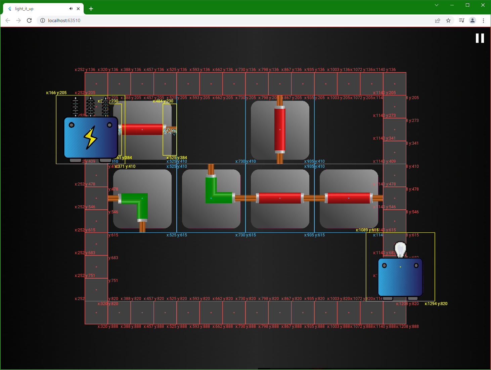

# Light It Up
Light It Up is a puzzle game that is developed with Flutter for [Flutter Puzzle Hack](https://flutterhack.devpost.com/).

## Description
The goal of the game is carrying electricity from generator to bulbs for lighting them up by sliding different kind of wires.

We used [Flame](https://docs.flame-engine.org/1.0.0/#about-flame) in this project. Flame is a game engine of Flutter. We hope that this project can be a helpful resource for whom want to develop a game with flame game engine. So, we decided to make this repository public.

Light It Up is deployed with [Firebase Hosting](https://firebase.google.com/docs/hosting). You can play it from: https://lightitup-75515.firebaseapp.com/.

## Supported Operating Systems
This game is mainly developed for Web. But, we designed algorithms in the way that we can support any scale. Thus, Light It Up can be run in an Android device or iOS device as well! So supported operating systems are: Web, Android and iOS.

## Screenshots
- Screenshots for 2 different levels that is taken in Chrome:

|Web Example 1|Web Example 2|
|-|-|
|||

- Screenshots for 2 different levels that is taken in an Android Emulator.

|Android Example 1|Android Example 2|
|-|-|
|||

## Debug Mode
Flame has a debug mode that enables you to see the position of game objects. You can just use the variables in the `AppConstants` class to enable or disable debug mode. The variables are as below:
https://github.com/kuyucuburak/LightItUp/blob/e9a3cf9259836bf4538baf2e13a7bfc24782b89d/lib/util/app_constants.dart#L4-L5

When debug mode is enabled, game looks like as below:

## License
Copyright 2022 Burak Kuyucu

Licensed under the Apache License, Version 2.0 (the "License");
you may not use this file except in compliance with the License.
You may obtain a copy of the License at

http://www.apache.org/licenses/LICENSE-2.0

Unless required by applicable law or agreed to in writing, software
distributed under the License is distributed on an "AS IS" BASIS,
WITHOUT WARRANTIES OR CONDITIONS OF ANY KIND, either express or implied.
See the License for the specific language governing permissions and
limitations under the License.
