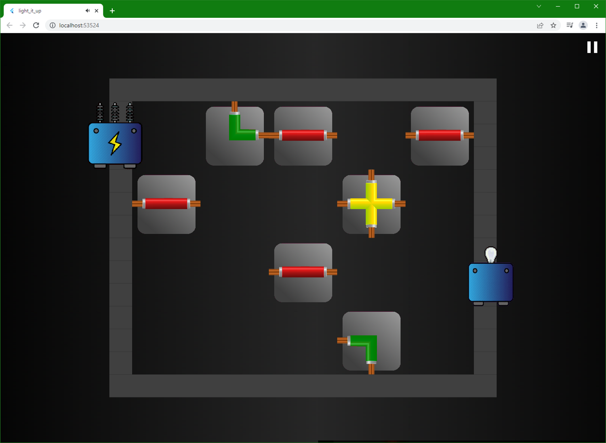
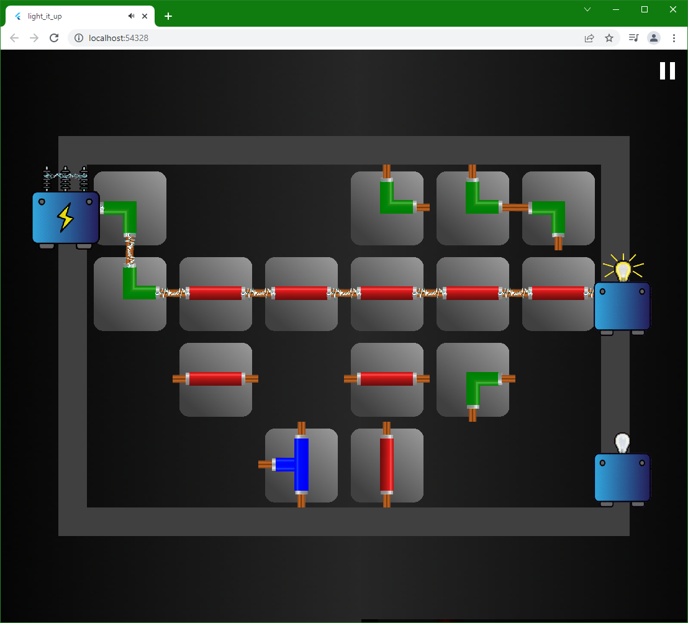
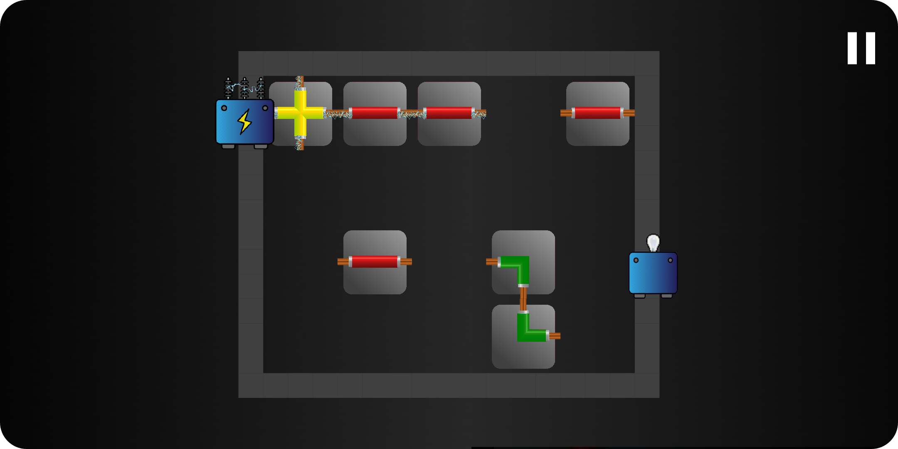
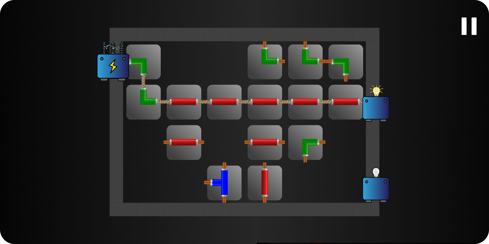

# Light It Up
Light It Up is a puzzle game that is developed with Flutter for [Flutter Puzzle Hack](https://flutterhack.devpost.com/).

## Description
The goal of the game is carrying electricity from generator to bulbs for lighting them up by sliding different kind of wires.

We used [Flame](https://docs.flame-engine.org/1.0.0/#about-flame) in this project. Flame is a game engine of Flutter. We hope that this project can be a helpful resource for whom want to develop a game with flame game engine. So, we decided to make this repository public.

Light It Up is deployed with [Firebase Hosting](https://firebase.google.com/docs/hosting). You can play it from: https://lightitup-75515.firebaseapp.com/.

## Supported Operating Systems
This game is mainly developed for Web. But, we designed algorithms in the way that we can support any scale. Thus, Light It Up can be run in an Android device or iOS device as well! So supported operating systems are: Web, Android and iOS.

## Screenshots
- Screenshots for 2 different levels that is taken in Chrome:

|Web Example 1|Web Example 2|
|-|-|
|||

- Screenshots for 2 different levels that is taken in an Android Emulator.

|Android Example 1|Android Example 2|
|-|-|
|||

